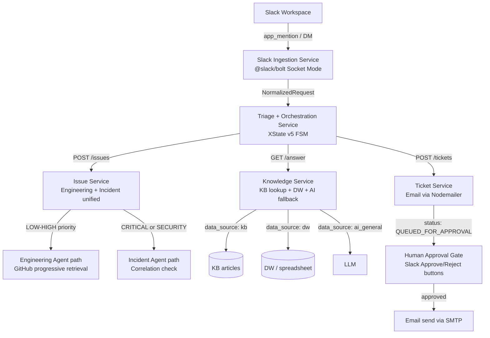

# Baseado no conhecimento contido no diretório @knowledge/  eu preciso orquestrar agentes contidos no diretório @knowledge/agents/ e seus requisitos de arquitetura, preciso que seja desenvolvido um plano para implementação de multiagentes descritos no arquivo @knowledge/04_agent_architecture.md em um modelo de estados finitos, com integração com o slack para receber uma mensagem bruta e posteriormente injetá-la no fluxo dos agentes de acordo com o documento @knowledge/00_project_context.md .  As ferramentas sugeridas são o XState, LangGraph ou ferramentas SaaS como o watsonx orchestrate. Para a máquina de estados e o @slack/bolt para ingestão de dados brutos do slack. Para finalizar, faça um comparativo com todas essas ferramentas de orquestração e opções disponíveis.

---

**Status:** active  **Date:** 2026-08-29

---

### 👤 User

Baseado no conhecimento contido no diretório @knowledge/  eu preciso orquestrar agentes contidos no diretório @knowledge/agents/ e seus requisitos de arquitetura, preciso que seja desenvolvido um plano para implementação de multiagentes descritos no arquivo @knowledge/04_agent_architecture.md em um modelo de estados finitos, com integração com o slack para receber uma mensagem bruta e posteriormente injetá-la no fluxo dos agentes de acordo com o documento @knowledge/00_project_context.md .  As ferramentas sugeridas são o XState, LangGraph ou ferramentas SaaS como o watsonx orchestrate. Para a máquina de estados e o @slack/bolt para ingestão de dados brutos do slack. Para finalizar, faça um comparativo com todas essas ferramentas de orquestração e opções disponíveis.

The user has referenced the following files/folders.
Use your file reading tools to access their content if needed.

- knowledge/ (folder):
  00_project_context.md
  01_product_constitution.md
  02_problem_model.md
  03_solution_model.md
  04_agent_architecture.md
  05_agent_registry.md
  06_workflow_architecture.md
  07_decision_architecture.md
  08_priority_model.md
  09_incident_model.md
  10_technical_architecture.md
  11_data_contracts.md
  12_tool_contracts.md
  13_development_plan.md
  14_testing_strategy.md
  15_mvp_scope.md
  16_demo_strategy.md
  agents
  decision-trees
  schemas
- knowledge/agents/ (folder):
  engineering_agent.md
  incident_agent.md
  knowledge_agent.md
  notification_agent.md
  refinement_agent.md
  ticket_agent.md
  triage_agent.md
- knowledge/04_agent_architecture.md
- knowledge/00_project_context.md

---

### 🤖 Assistant

> 🔧 called: use_skill


> 🔧 **use_skill** — create-plan

### 🤖 Assistant

> 🔧 called: read_file, read_file, read_file, read_file, read_file, read_file, read_file, read_file

Now let me read all the relevant knowledge files in parallel:

> 🔧 **read_file** — knowledge/00_project_context.md

> 🔧 **read_file** — knowledge/04_agent_architecture.md

> 🔧 **read_file** — knowledge/06_workflow_architecture.md

> 🔧 **read_file** — knowledge/10_technical_architecture.md

> 🔧 **read_file** — knowledge/05_agent_registry.md

> 🔧 **read_file** — knowledge/13_development_plan.md

> 🔧 **read_file** — knowledge/agents/triage_agent.md

> 🔧 **read_file** — knowledge/agents/refinement_agent.md

### 🤖 Assistant

> 🔧 called: read_file, read_file, read_file, read_file, read_file, read_file, list_files

Now let me read the remaining agent files and some other relevant documents:

> 🔧 **read_file** — knowledge/agents/engineering_agent.md

> 🔧 **read_file** — knowledge/agents/incident_agent.md

> 🔧 **read_file** — knowledge/agents/ticket_agent.md

> 🔧 **list_files** — knowledge

> 🔧 **read_file** — knowledge/agents/notification_agent.md

> 🔧 **read_file** — knowledge/agents/knowledge_agent.md

> 🔧 **read_file** — knowledge/11_data_contracts.md

### 🤖 Assistant

> 🔧 called: list_files, read_file, list_files

Now I have a thorough understanding of the entire architecture. Let me check the current codebase to see if any implementation exists:

> 🔧 **list_files** — .

> 🔧 **list_files** — scripts

> 🔧 **read_file** — README.md

### 🤖 Assistant

> 🔧 called: write_file

I now have a complete picture of the entire knowledge base. There is no existing implementation yet — it's purely in the architecture/planning phase. I have everything needed to write a comprehensive plan with tooling comparison. Let me now write the plan file:

> 🔧 **write_file** — multiagent-orchestration-plan.md

### 🤖 Assistant

> 🔧 called: ask_followup_question

The plan file has been written to [`multiagent-orchestration-plan.md`](multiagent-orchestration-plan.md). Here's a full overview for your review:

---

## What the plan covers

### Tooling Comparative Analysis

| Criterion | XState v5 | LangGraph | watsonx Orchestrate |
|---|---|---|---|
| FSM model | ✅ First-class Statecharts | ⚠️ DAG/graph, not strict FSM | ⚠️ BPM-style workflows |
| Language | ✅ TypeScript (same runtime as Bolt) | ❌ Python — requires bridge | N/A (SaaS) |
| Slack Bolt integration | ✅ Native, same process | ❌ Cross-process bridge needed | ❌ REST webhook adapter |
| Parallel states (CRITICAL path) | ✅ `type: parallel` native | ⚠️ `Send` nodes | ✅ But proprietary |
| Timeout management | ✅ `after()` declarative | ⚠️ Custom asyncio timers | ✅ Managed |
| Hackathon viability | ✅ Zero infra, runs locally | ⚠️ Python-only runtime | ❌ Cloud provisioning required |
| Human-in-the-loop | ✅ `invoke` + external event | ✅ Interrupt nodes | ✅ Approval flows |
| Open source / vendor lock-in | ✅ MIT | ✅ MIT | ❌ IBM commercial |

**Selected: XState v5** — maps 1:1 to the existing state diagram in `knowledge/06_workflow_architecture.md`, runs natively alongside `@slack/bolt`, and requires zero infrastructure.

---

### Architecture flow (high level)

```mermaid
flowchart TD
    Slack[Slack Workspace] -->|app_mention / DM| Bolt[@slack/bolt Socket Mode]
    Bolt --> Adapter[Slack Adapter\nsrc/slack/adapter.ts]
    Adapter -->|NormalizedRequest| Dispatcher[Dispatcher\nsrc/slack/dispatcher.ts]
    Dispatcher -->|creates actor| FSM[XState Orchestrator Machine\nsrc/orchestrator/machine.ts]

    FSM -->|invokes| Refinement[Refinement Agent]
    Refinement -->|is_complete false| CP[CLARIFICATION_PENDING\nwait 30min]
    CP -->|reply| FSM
    Refinement -->|is_complete true| Triage[Triage Agent]
    Triage --> Router{Route guard}
    Router -->|knowledge| KA[Knowledge Agent]
    Router -->|engineering| EA[Engineering Agent]
    Router -->|ticket| TA[Ticket Agent]
    Router -->|incident| IA[Incident Agent]
    Router -->|CRITICAL| PAR[Parallel: Incident + Approval Gate]
    KA & EA & TA & IA & PAR --> ActionEngine[Action Engine\nhuman approval if needed]
    ActionEngine --> Notification[Notification Agent → Slack]
```

---

### 7 Sub-Tasks

| # | Sub-Task | Key Deliverable |
|---|---|---|
| 1 | Project Scaffolding & Shared Types | `package.json`, `tsconfig.json`, all TypeScript interfaces from `11_data_contracts.md`, `LLMClient` |
| 2 | Slack Ingestion Layer | `@slack/bolt` app, `adapter.ts`, `dispatcher.ts` (in-flight actor map), `sender.ts` |
| 3 | XState Orchestrator Machine | Full statechart with all 13 states, timeouts via `after()`, CRITICAL parallel path |
| 4 | Agent Stubs + Invocation Interface | `AgentRunner<TInput,TOutput>`, stubs for all 7 agents, real `notification.ts` |
| 5 | Action Engine & Human Approval Gate | Authorization validation, Slack button-based approval, FSM event dispatch |
| 6 | Decision Trace Persistence | SQLite schema, append-only `TraceRepository`, wired into every FSM transition |
| 7 | E2E Integration Tests | Primary workflow, clarification loop, CRITICAL parallel path, routing table |

---

A few questions to validate the plan before switching to implementation:

### 🤖 Assistant

Does the tooling selection (XState v5 + @slack/bolt) and the 7 sub-task breakdown match your expectations? Are there any constraints or preferences I should adjust?

> 🔧 **ask_followup_question** — Does the tooling selection (XState v5 + @slack/bolt) and the 7 sub-task breakdown match your expectations? Are there any constraints or preferences I should adjust?

---

### 👤 User

I have a requirement regarding a microservices-based architecture (API). I need to implement a model using Slack/Bolt (Slack adapter) in conjunction with a @knowledge/agents/triage_agent.md within an API.
For other API services, I need an interface for each agent requested by the triage agent (@knowledge/agents/knowledge_agent.md, [@knowledge/agents/engineering_agent.md , @knowledge/agents/incident_agent.md ], @knowledge/agents/ticket_agent.md ), with each interface serving a specific function.

Regarding domain-specific functions: the Knowledge Agent will be responsible for answering general questions, whether or not they relate to the organization. If a question involves organizational data, the agent will query a database—such as a data warehouse or a spreadsheet acting as a knowledge base—to provide an answer. Otherwise, it will answer based on the AI's inherent knowledge and the project's governance standards.

The Ticket Agent will be responsible for submitting a ticket via email.

The Engineering Agent and Incident Agent handle similar types of issues, differing only in severity (e.g., standard bugs versus critical incidents); they can be consolidated into a single interface. It must output the information collected up to that point to an external interface.

The user has referenced the following files/folders.
Use your file reading tools to access their content if needed.

- knowledge/agents/triage_agent.md
- knowledge/agents/knowledge_agent.md
- knowledge/agents/engineering_agent.md
- knowledge/agents/incident_agent.md
- knowledge/agents/ticket_agent.md

---

### 🤖 Assistant

> 🔧 called: read_file, read_file, read_file, read_file, read_file, read_file

Let me re-read the relevant agent specs to ground the updated plan in the actual contracts before revising anything.

> 🔧 **read_file** — knowledge/agents/triage_agent.md

> 🔧 **read_file** — knowledge/agents/knowledge_agent.md

> 🔧 **read_file** — knowledge/12_tool_contracts.md

> 🔧 **read_file** — knowledge/agents/engineering_agent.md

> 🔧 **read_file** — knowledge/agents/incident_agent.md

> 🔧 **read_file** — knowledge/agents/ticket_agent.md

### 🤖 Assistant

> 🔧 called: write_file

Now I have the full picture of the new requirements. Let me update the plan file to reflect the microservices architecture with the API interfaces, the consolidated Engineering+Incident agent interface, the expanded Knowledge Agent behavior, and the email-based Ticket Agent.

> 🔧 **write_file** — multiagent-orchestration-plan.md

### 🤖 Assistant

The plan file is fully updated. Let me now present the complete picture to you:

---

## Updated Plan: [`multiagent-orchestration-plan.md`](multiagent-orchestration-plan.md)

Here is the revised architecture based on your microservices requirement:

### What changed from the previous version

| Aspect | Before | Now |
|---|---|---|
| Architecture | Modular monolith | **Microservices: one package per service** |
| Engineering + Incident | Separate agents | **Unified `POST /issues` service, routed internally by severity** |
| Ticket delivery | Mock REST stub | **Email via Nodemailer, always gated behind human approval** |
| Knowledge Agent | KB lookup only | **3-tier: KB vector → DW/spreadsheet → AI general fallback** |
| Sub-tasks | 7 | **9 (split into per-service tasks)** |

---

### System architecture



---

### Service Interface Contracts Summary

| Service | Endpoint | Input | Response |
|---|---|---|---|
| **Knowledge Service** | `GET /answer` | `NormalizedRequest` + `TriageResult` | `KnowledgeResult` + `data_source` field |
| **Issue Service** | `POST /issues` | `NormalizedRequest` + `TriageResult` + optional `candidate_requests` | `IssueResult` (unified Engineering + Incident) + `external_payload` |
| **Ticket Service** | `POST /tickets` | `NormalizedRequest` + `TriageResult` + optional `KnowledgeResult` | `TicketResult` with `status: QUEUED_FOR_APPROVAL` |
| **Ticket Service (send)** | `POST /tickets/:id/send` | _(called after human approval)_ | Email dispatched via SMTP |

### Key design decisions locked in the plan

1. **Issue Service unified by severity** — `LOW/MEDIUM/HIGH` → Engineering Agent path (GitHub analysis + issue draft); `CRITICAL` or `SECURITY` → Incident Agent first, then Engineering if domain=SOFTWARE. The `external_payload` field in `IssueResult` carries all collected data ready for forwarding to any external system (Jira, PagerDuty, etc.).

2. **Knowledge Service 3-tier resolution** — KB vector search → Data Warehouse/spreadsheet query (org data) → LLM general knowledge. The `data_source` field always indicates which tier answered.

3. **Ticket Service via email** — always returns `QUEUED_FOR_APPROVAL`; the actual SMTP send fires only after the human approval gate in the Orchestration Service dispatches `ACTION_APPROVED` and calls `POST /tickets/:id/send`.

4. **Triage is co-located with Orchestration** — Triage is tightly coupled to the FSM routing logic and has no value as a standalone service. It runs inline in the Orchestration Service.

Does this plan correctly capture your requirements? Any adjustments before switching to implementation?

---

### 👤 User

The output of `/post issues` should be stored so it can be consumed by a subsequent GET request from another client. I recommend implementing a system based on GET/POST and consumer lists.

---

### 🤖 Assistant

> 🔧 called: read_file, read_file

Let me re-read the current plan's Issue Service section before revising.

> 🔧 **read_file** — multiagent-orchestration-plan.md

> 🔧 **read_file** — multiagent-orchestration-plan.md

### 🤖 Assistant

> 🔧 called: read_file

Now let me read the Issue Service sub-task in full to understand the complete scope before rewriting it:

> 🔧 **read_file** — multiagent-orchestration-plan.md

### 🤖 Assistant

> 🔧 called: read_file

Now I have the full picture. The requirement is clear: `POST /issues` produces a stored result, and external clients (dashboards, incident tools, Jira, PagerDuty integrations) can poll with `GET /issues` using a consumer-list model. Let me update the plan with the precise changes needed — the interface contracts section, the Issue Service sub-task, and the shared types.

> 🔧 **read_file** — multiagent-orchestration-plan.md

### 🤖 Assistant

> 🔧 called: apply_diff

Now I have exactly what I need. I'll update three sections of the plan: the architecture diagram, the Issue Service interface contract, and Sub-Task 5. The consumer-list model needs to be precisely specified.

> 🔧 **apply_diff** — multiagent-orchestration-plan.md

### 🤖 Assistant

> 🔧 called: apply_diff

Now update the System Architecture diagram and the Issue Service interface contract section:

> 🔧 **apply_diff** — multiagent-orchestration-plan.md

### 🤖 Assistant

> 🔧 called: apply_diff

Now update Sub-Task 5 to reflect the new persistence and consumer-list requirements:

> 🔧 **apply_diff** — multiagent-orchestration-plan.md

### 🤖 Assistant

> 🔧 called: read_file, read_file, apply_diff

Now update the file structure section to reflect the new `store/` directory in issue-service:

> 🔧 **read_file** — multiagent-orchestration-plan.md

> 🔧 **read_file** — multiagent-orchestration-plan.md

> 🔧 **apply_diff** — <<<<<<< SEARCH
:start_line:770
-------
**Todo List**
1. Create `tests/e2e/software-workflow.test.ts`:
   - Mock `app_mention` for a software bug
   - Start mock Issue Service returning fixture `IssueResult`
   - Verify FSM reaches `RESOLVED`, Decision Trace has all steps
2. Create `tests/e2e/knowledge-workflow.test.ts`:
   - QUESTION domain → Knowledge Service
   - Test KB path (high relevance), DW path (org-specific), AI fallback (general question)
3. Create `tests/e2e/ticket-workflow.test.ts`:
   - HARDWARE domain → Ticket Service
   - Verify `status: "QUEUED_FOR_APPROVAL"` returned
   - Dispatch `ACTION_APPROVED` → verify `POST /tickets/:id/send` called
4. Create `tests/e2e/critical-path.test.ts`:
   - CRITICAL priority → parallel state
   - Dispatch `ACTION_APPROVED` → verify FSM resolves
5. Create `tests/e2e/clarification-loop.test.ts`
6. Create `tests/unit/router.test.ts` — all 8 domain routing cases
=======
**Todo List**
1. Create `tests/e2e/software-workflow.test.ts`:
   - Mock `app_mention` for a software bug
   - Start mock Issue Service returning fixture `IssueResult`
   - Verify FSM reaches `RESOLVED`, Decision Trace has all steps
2. Create `tests/e2e/knowledge-workflow.test.ts`:
   - QUESTION domain → Knowledge Service
   - Test KB path (high relevance), DW path (org-specific), AI fallback (general question)
3. Create `tests/e2e/ticket-workflow.test.ts`:
   - HARDWARE domain → Ticket Service
   - Verify `status: "QUEUED_FOR_APPROVAL"` returned
   - Dispatch `ACTION_APPROVED` → verify `POST /tickets/:id/send` called
4. Create `tests/e2e/critical-path.test.ts`:
   - CRITICAL priority → parallel state
   - Dispatch `ACTION_APPROVED` → verify FSM resolves
5. Create `tests/e2e/clarification-loop.test.ts`
6. Create `tests/unit/router.test.ts` — all 8 domain routing cases
7. Create `tests/unit/issue-store.test.ts` — consumer-list model:
   - Register two consumers with different filters
   - `POST /issues` × 3 with varying priority/domain
   - Verify `GET /issues?consumer_id=A` returns only items matching A's filter
   - Verify `GET /issues?consumer_id=B` returns its own independent set
   - `POST /issues/ack` for consumer A → verify cursor advances
   - Second `GET /issues?consumer_id=A` returns only new items after cursor
   - Verify consumer B cursor is unchanged
>>>>>>> REPLACE

<<<<<<< SEARCH
:start_line:839
-------
    ├── issue-service/              # Sub-Task 5
    │   └── src/
    │       ├── server.ts
    │       ├── router.ts
    │       ├── agents/
    │       │   ├── engineering.ts
    │       │   └── incident.ts
    │       └── github/
    │           └── client.ts
=======
    ├── issue-service/              # Sub-Task 5
    │   └── src/
    │       ├── server.ts
    │       ├── router.ts
    │       ├── agents/
    │       │   ├── engineering.ts
    │       │   └── incident.ts
    │       ├── github/
    │       │   └── client.ts
    │       └── store/
    │           ├── issue-store.ts      # SQLite: issues table, save/getSince/getFiltered
    │           └── consumer-registry.ts # SQLite: consumers table, cursor management
>>>>>>> REPLACE


### 🤖 Assistant

All changes are in. Here's a precise summary of what was updated in [`multiagent-orchestration-plan.md`](multiagent-orchestration-plan.md):

---

## What changed

### 1 — Overview & architecture diagram

The Issue Service now shows the **full surface area** it exposes — both as a producer (called by the Orchestration FSM) and as a store (polled by external consumers):

```
┌─────────────────────┐
│    ISSUE SERVICE     │
│                      │
│ POST /issues         │
│   ↓ persists result  │
│ GET /issues?consumer │
│   ↓ consumer polling │
│                      │
│• Engineering Agent   │
│• Incident Agent      │
│  (by severity)       │
└──────────┬───────────┘
           │ GET /issues
┌──────────┼───────────────┐
▼          ▼               ▼
[Dashboard] [Jira/PagerDuty] [Any consumer]
```

---

### 2 — Issue Service interface contracts (4 endpoints defined)

| Endpoint | Called by | Purpose |
|---|---|---|
| `POST /issues` | Orchestration Service | Run agent, persist result, return synchronously |
| `GET /issues?consumer_id&limit&since_issue_id` | Any external consumer | Poll unacknowledged results, cursor-based |
| `POST /issues/ack` | Consumer | Advance read cursor after processing |
| `POST /consumers` | Consumer (registration) | Register consumer + optional filter |

**Consumer-list model — key invariants:**
- Each consumer has its own independent `cursor_issue_id` — the `issue_id` of the last acknowledged item
- `GET /issues` returns only items **after the cursor** that pass the consumer's registered filters
- `POST /issues/ack` advances the cursor — items are never deleted, only "seen" per-consumer
- Multiple slow consumers never block each other

---

### 3 — Sub-Task 5 restructured into 3 explicit steps

| Step | What gets built |
|---|---|
| **A — Storage layer** | `issue-store.ts` (SQLite `issues` table, `save/getSince/getFiltered`) + `consumer-registry.ts` (SQLite `consumers` table, cursor management) |
| **B — Agent logic** | `router.ts` (severity routing), `engineering.ts`, `incident.ts`, `github/client.ts` |
| **C — HTTP layer** | All 6 routes on `server.ts` including `GET /issues/:issue_id` for direct lookup |

---

### 4 — Tests (Sub-Task 9): new `issue-store.test.ts`

A dedicated unit test that exercises the consumer-list model in isolation: two consumers with different filters, three produced issues, independent cursors, ack advancement, and cursor isolation verification.

Does this accurately capture what you need?

---

### 👤 User

Yes

---

### 🤖 Assistant

> 🔧 called: switch_mode, start_subtask


> 🔧 **switch_mode** — agent

> 🔧 **start_subtask** — Sub-Task 1 — Project Scaffolding, Monorepo, and Shared Types

### 🤖 Assistant

> 🔧 called: start_subtask

Sub-Task 1 is done. Now launching Sub-Task 2:

> 🔧 **start_subtask** — Sub-Task 2 — Slack Ingestion Service

### 🤖 Assistant

> 🔧 called: start_subtask

Sub-Task 2 is done. Launching Sub-Task 3:

> 🔧 **start_subtask** — Read the full plan at `multiagent-orchestration-plan.md` before starting. Then implement **Sub-Task 3 — Triage + Orchestration Service: XState FSM** exactly as described in that file.

Summary of what to build inside `packages/orchestration-service/src/`:

- `src/agents/refinement.ts` — Refinement Agent stub implementing `AgentRunner<RefinementInput, NormalizedRequest>`. Stub: returns the input with `is_complete: true`, documents the LLM injection point. Accept: `{ raw_message, clarification_history, slack_user_id, timestamp }`.
- `src/agents/triage.ts` — Triage Agent stub implementing `AgentRunner<TriageInput, TriageResult>`. Stub: returns a deterministic `TriageResult` with `domain: 'SOFTWARE'`, `route: 'engineering'`, `confidence: 0.9`, `priority: 'MEDIUM'`, `requires_human: false`.
- `src/trace.ts` — `appendTraceStep(context, from, to, agent, decision)` that pushes a `DecisionTraceStep` into `context.trace.steps`.
- `src/router.ts` — `getRoute(triageResult): 'knowledge' | 'issue' | 'ticket'` deterministic routing guard implementing the full routing table from `knowledge/05_agent_registry.md`.
- `src/http/agent-client.ts` — HTTP client with `callKnowledge`, `callIssue`, `callTicket` functions using `fetch`. Each reads the service URL from environment config.
- `src/machine.ts` — XState v5 statechart implementing ALL states from `knowledge/06_workflow_architecture.md`:
  - RECEIVED → NORMALIZING (invoke refinement) → CLARIFICATION_PENDING (after 30min → READY_FOR_TRIAGE) → READY_FOR_TRIAGE → TRIAGING (invoke triage) → TRIAGED → CONTEXT_RETRIEVAL → AGENT_EXECUTING (invoke correct agent service via agent-client, 60s timeout, 1 retry) → ACTION_PENDING (4h timeout) → ACTION_EXECUTED → VERIFYING → RESOLVED
  - Failure states: ESCALATED, ABANDONED
  - CRITICAL parallel path: when priority=CRITICAL in TRIAGED, enter a parallel compound state (Region 1: AGENT_EXECUTING path; Region 2: HUMAN_APPROVAL_GATE)
  - All timeouts via XState `after()`
  - Decision Trace appended on every state `entry` action
- `src/index.ts` — exports `createRequestActor(request: NormalizedRequest): ActorRef` using `createActor(orchestratorMachine, { input: { request } })` and `.start()`

The machine context type is `OrchestratorContext` with: `request`, `triageResult`, `agentResult`, `trace`, `retryCount`, `error`.

After implementation verify `tsc --noEmit` passes for `packages/orchestration-service`.

### 🤖 Assistant

> 🔧 called: start_subtask

Sub-Task 3 done. Launching Sub-Tasks 4, 5, and 6 in parallel — they are independent services:

> 🔧 **start_subtask** — Read the full plan at `multiagent-orchestration-plan.md` before starting. Then implement **Sub-Task 4 — Knowledge Service** exactly as described in that file.

Build inside `packages/knowledge-service/src/`:

- `src/server.ts` — Express app on port 3001. Routes: `GET /answer` (body: `{ request_id, normalized_request, triage_result }`), `GET /health`
- `src/retrieval/kb.ts` — loads Markdown files from `data/kb/`, embeds them at startup using `LLMClient.embed`, stores vectors in memory. `search(query, domain?, topK=5): KBArticle[]` using cosine similarity
- `src/retrieval/datawarehouse.ts` — reads `data/dw/org-data.json`. `query(intent, domain): DWResult[]` using keyword/fuzzy match. Designed to be replaced with a real DW connector
- `src/agent.ts` — `KnowledgeAgentRunner.run(input)`:
  1. `kb.search(intent)` → if max score >= 0.6 → compose answer from KB snippets via LLM
  2. Else if domain is org-specific (BUSINESS_PROCESS, DIGITAL, QUESTION + org keywords) → `datawarehouse.query(intent)`
  3. Else → LLM general knowledge answer
  4. If confidence < 0.7 in all paths → `resolved: false`, `escalation_recommended: true`
  - Always set `data_source` field in response

Seed data to create:
- `data/kb/` — at least 5 Markdown articles covering: VPN access issues, ERP invoice module errors, SaaS tool account reset, password policy, software deployment process
- `data/dw/org-data.json` — mock org data: team contacts, system owners, escalation paths, process documents

Use `MockLLMClient` from `packages/llm-client` for all LLM calls (the interface must be injectable). Do not call any real LLM API.

After implementation verify `tsc --noEmit` passes for `packages/knowledge-service`.