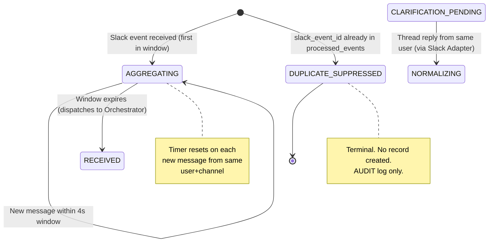

# 17 — Intake Ingestion Policy

**File:** `knowledge/17_intake_ingestion.md`  
**Scope:** Mechanics of turning Slack events into request records. Does NOT cover normalization, classification, or clarification content.  
**Depends on:** `06_workflow_architecture.md`, `10_technical_architecture.md`, `11_data_contracts.md`, `17_intake_audit.md`  
**Used by:** Dev 1 (Slack Adapter, `src/slack/adapter.ts`), Dev 5 (Orchestrator, `src/db/schema.ts`), integration testing  
**Resolves audit gaps:** CG-1, CG-2, CG-3, CG-4, CG-5; Contract defects CD-2, CD-5, CD-6; Conflicts 1, 2

---

## 1. TRIGGER POLICY

Which Slack events create or update a request. Default: **most Slack messages are silently ignored.**

| Event type | Condition | Action | Justification |
|---|---|---|---|
| `app_mention` in channel | Bot is mentioned (`<@BOT_ID>`) in message text | **CREATE new request** | Explicit user intent; primary interface |
| DM to bot (`message` in `im` channel) | Any message from a non-bot user | **CREATE new request** | DMs are always directed at the bot |
| Thread reply to bot-owned thread | `event.thread_ts` matches an open request's `thread_ts`; request status is `CLARIFICATION_PENDING` | **UPDATE existing request** (append clarification answer) | Continuation of an existing conversation |
| Thread reply to bot-owned thread | Same as above but request status is NOT `CLARIFICATION_PENDING` | **IGNORE** — log at DEBUG | Request is no longer waiting; duplicate reply |
| Plain channel message (no mention) | Bot not mentioned; not a reply to bot-owned thread | **IGNORE** — no action, no log | Not every company message should be processed |
| Bot's own messages | `event.bot_id` is present OR `event.user === BOT_USER_ID` | **IGNORE** immediately | Prevents feedback loops |
| Message edit (`message_changed` subtype) | Any | **IGNORE** for MVP | Editing after submission not supported; would corrupt `original_message` immutability |
| Message deletion (`message_deleted` subtype) | Any | **IGNORE** for MVP | `original_message` is immutable by design (Invariant I1 applies by analogy) |
| `app_mention` from bot account | `event.user === BOT_USER_ID` | **IGNORE** | Bot self-mention guard |

**Default rule (enforced first, before all other checks):**  
```
if event.bot_id exists OR event.user === BOT_USER_ID → discard immediately, return
```

**Trigger check order** (deterministic, no LLM):
1. Discard bot messages
2. If `im` channel → CREATE
3. If `event.thread_ts` matches open request + status is `CLARIFICATION_PENDING` → UPDATE
4. If message contains `<@BOT_ID>` mention → CREATE
5. Else → IGNORE

**Failure behaviour:** Any error in the trigger check (DB lookup fails, malformed event) → IGNORE the event and emit an AUDIT log entry. Never crash the process; never retry automatically (Slack will retry if no 200 is returned — see §5).

---

## 2. MESSAGE AGGREGATION

### The scenario
User posts in rapid succession (9 seconds total):
1. "gente"
2. "to com problema no ERP"
3. "na hora de gerar nota"
4. "da erro 500"

### Decision: **One request, after a debounce window**

**Rationale:** Four separate requests would each trigger Refinement independently, producing four clarification questions and four parallel workflows. Silence is the correct behaviour until the user has finished expressing their thought. The primary demo scenario explicitly depends on compound context ("ERP" + "invoice" + "500 error") being treated as one request.

### Debounce rules by message context

| Context | Window | Resets on | Final trigger |
|---|---|---|---|
| **Channel with `app_mention`** | **4 seconds** after the first mentioning message | Any new message from the same user in the same channel (mention or not) | Window expiry with no new message |
| **DM to bot** | **4 seconds** after first message | Any new DM from the same user | Window expiry |
| **Thread reply** (clarification answer) | **No debounce** — first reply is processed immediately | N/A — updates existing request | Immediate on receipt |

**Why 4 seconds, not 5:** Slack's retry timeout is 3 seconds (see §5). A 4-second debounce ensures the ack returns before the window closes, so no retries race with the debounce timer.

### What happens if the 5th message arrives after the window has closed

The window is closed and a record has already been created (status `NORMALIZING`). The 5th message:
- Is **not** a thread reply (no `thread_ts` matching an open request) → treated as a **new top-level request** following the full trigger policy.
- Is a reply in the same thread → follows the thread-reply rule in §1 (UPDATE if `CLARIFICATION_PENDING`, IGNORE otherwise).

### How aggregated text is stored

All messages collected within the debounce window are concatenated in arrival order, separated by `\n`, and stored in `original_message`. This field is immutable after record creation.

```
original_message: "gente\nto com problema no ERP\nna hora de gerar nota\nda erro 500"
```

`original_message` is the only field that receives the concatenated text. No other `NormalizedRequest` field is populated at aggregation time — `normalized_message`, `intent`, and all hints are set later by the Refinement Agent.

**No deduplication of repeated phrases** within the window. The Refinement Agent's normalization step handles redundancy.

### OPEN QUESTION OQ-1
What is the maximum total character length of an aggregated message before the window closes? No limit is defined in current knowledge. **Suggest:** cap at 4,000 characters; truncate with a note appended to `original_message`: `[truncated at 4000 chars]`. Dev 1 to decide.

---

## 3. IDEMPOTENCY

### Problem (from audit CD-6)
Slack retries delivery if the handler does not respond with HTTP 200 within 3 seconds. Socket Mode (chosen in `10_technical_architecture.md`) acknowledges automatically via the WebSocket frame, but the `ack()` callback in Bolt must still be called synchronously. Any async processing after `ack()` must be separated from the ack path.

### Deduplication key

| Field | Source | Value |
|---|---|---|
| `slack_event_id` | `event.event_ts` from the Slack event payload | Unique per Slack event |

`event.event_ts` is a Unix timestamp string with microsecond precision (e.g., `"1714000000.123456"`). It is stable across retries of the same event.

**Fallback:** If `event.event_ts` is absent (malformed payload), use `payload.event_id` (the outer envelope ID). If both are absent, generate a UUID and log a WARNING — the event cannot be deduplicated.

### Storage

- Stored as `slack_event_id` on the request record (unique index in the DB).
- Additionally stored in a separate `processed_events` table (TTL: 24 hours) for the window before the full request record is created, so that retries arriving during the debounce window are also caught.

```sql
-- processed_events: lightweight dedup table
CREATE TABLE processed_events (
  slack_event_id TEXT PRIMARY KEY,
  first_seen_at  TIMESTAMPTZ NOT NULL DEFAULT now(),
  request_id     UUID NULL,  -- set after request record is created
  expires_at     TIMESTAMPTZ NOT NULL  -- first_seen_at + 24h
);
```

### Behaviour on retry

| Arrival time | Condition | Action |
|---|---|---|
| Before debounce window closes | `slack_event_id` already in `processed_events` | Extend debounce window if same user+channel; otherwise ignore |
| After window closes, request not yet created | `slack_event_id` in `processed_events`, `request_id` is null | Ignore — processing in flight |
| After request created | `slack_event_id` in `processed_events`, `request_id` set | Return 200; do nothing |
| `slack_event_id` absent from `processed_events` | First delivery | Insert into `processed_events`; begin debounce |

### TTL
24 hours. Slack's retry policy gives up after ~1 hour, so 24 hours provides a safe margin with no permanent table growth.

### Schema change required in `request.schema.json`
Add field:
```json
"slack_event_id": {
  "type": "string",
  "description": "Slack event_ts. Unique index. Used for deduplication of Slack retries."
}
```
Add `"slack_event_id"` to the `required` array.

---

## 4. CONCURRENCY

### Cap on simultaneous open requests per user

**Rule:** A user may have at most **one open request per Slack channel** (where "open" means any status except `RESOLVED`, `ABANDONED`, or `ESCALATED`).

DMs are a single channel per user; this cap applies there too.

**Rationale:** The clarification loop assumes one active context per thread. Multiple concurrent open requests in the same channel make thread-reply routing ambiguous.

### When a new top-level message arrives while a request is open

| Existing request status | New message type | Action |
|---|---|---|
| `CLARIFICATION_PENDING` | `app_mention` or DM (new thread, not a reply) | Send: *"Você já tem uma solicitação aberta: [REQ-ID]. Responda naquela conversa ou aguarde a resolução antes de abrir uma nova."* Do NOT create a new request. |
| Any other status (`NORMALIZING`, `TRIAGING`, etc.) | Any new top-level message | Create new request normally. Previous request is in processing — it has no pending question waiting for the user. |
| None | Any | Create new request normally. |

### Thread-reply routing (resolves audit gap CG-4)

When a Slack event arrives with `event.thread_ts` set:

```
1. Look up open request where thread_ts = event.thread_ts AND slack_user_id = event.user
2. If found AND status = CLARIFICATION_PENDING:
     → UPDATE request: append answer to clarification_history, set status = NORMALIZING
     → Dispatch to Orchestrator as clarification-reply event
3. If found AND status ≠ CLARIFICATION_PENDING:
     → IGNORE (log DEBUG: "reply to non-pending thread ignored")
4. If not found:
     → Apply trigger policy (§1) to treat as new message
```

**Tie-break when multiple open requests share the same `thread_ts`:** This cannot happen by design — `thread_ts` is unique per Slack thread and each request stores one `thread_ts`. If the DB constraint is violated (bug), log ERROR and route to the most recently created request.

### Failure behaviour
DB lookup fails → treat as "no match found" → apply trigger policy. Do not block the ack.

---

## 5. SYNC / ASYNC BOUNDARY

Socket Mode is confirmed in `10_technical_architecture.md`. Slack Bolt's Socket Mode acknowledges via the WebSocket frame automatically when `ack()` is called.

### What happens BEFORE ack (synchronous, must complete < 3s)

| Step | Component | Max time |
|---|---|---|
| Verify Slack signing secret (already decided) | Bolt middleware | < 5ms |
| Check `processed_events` table for `slack_event_id` | Slack Adapter | < 20ms |
| Apply trigger policy (§1) | Slack Adapter | < 5ms |
| If UPDATE path: look up open request by `thread_ts` + `user` | Slack Adapter | < 20ms |
| Insert into `processed_events` (if new event) | Slack Adapter | < 20ms |
| Call `ack()` | Bolt | — |

**Total synchronous budget: < 70ms.** No LLM calls, no Refinement Agent, no Orchestrator invocation.

### What happens AFTER ack (asynchronous, no time constraint)

| Step | Component |
|---|---|
| Debounce timer management | Slack Adapter (in-process timer) |
| On debounce expiry: create/update request record in DB | Slack Adapter |
| Append RECEIVED Decision Trace step | Orchestrator (called by Adapter after record created) |
| Dispatch to Orchestrator for NORMALIZING | Slack Adapter → Orchestrator |
| Orchestrator invokes Refinement Agent | Orchestrator |

### Implementation pattern (Socket Mode / Bolt)

```
app.event('app_mention', async ({ event, ack }) => {
  await ack();                          // synchronous, < 70ms
  await processEventAsync(event);       // truly async, no timeout constraint
});
```

**Failure behaviour:** If `processEventAsync` throws, log ERROR with `slack_event_id`. Do not call `ack()` again (already called). The event is already in `processed_events` as seen — it will not be retried by Slack. Log a AUDIT entry for manual recovery if needed.

---

## 6. STATE MACHINE DELTA

Do not read this as a rewrite of `06_workflow_architecture.md`. This is a diff only.

### States to ADD

| New state | Description | Entered from | Exits to |
|---|---|---|---|
| `AGGREGATING` | Debounce window is open; collecting messages from same user+channel | Slack Adapter on first trigger | `RECEIVED` (on window expiry) or `AGGREGATING` (on new message in window) |
| `DUPLICATE_SUPPRESSED` | Incoming event matched `processed_events`; no new record created | Slack Adapter | terminal (no further processing) |

### Transitions to ADD

| From | To | Condition | Actor |
|---|---|---|---|
| `AGGREGATING` | `AGGREGATING` | New message from same user+channel within debounce window | Slack Adapter (extend timer, append to buffer) |
| `AGGREGATING` | `RECEIVED` | Debounce window expires | Slack Adapter (create DB record, dispatch) |
| (no record) | `DUPLICATE_SUPPRESSED` | `slack_event_id` already in `processed_events` | Slack Adapter |
| `CLARIFICATION_PENDING` | `NORMALIZING` | Thread reply received from same user; answer appended | Slack Adapter → Orchestrator |

### Transitions that are FORBIDDEN

| Forbidden transition | Reason |
|---|---|
| `CLARIFICATION_PENDING` → `NORMALIZING` triggered by a **new top-level message** | A new top-level message is a new request, not a clarification answer. Must not update an existing request's clarification_history with off-thread content. |
| Any state → `AGGREGATING` after `RECEIVED` | Aggregation only happens before a record exists. Once `RECEIVED`, the record is locked. |
| `DUPLICATE_SUPPRESSED` → any other state | Terminal. No recovery. A suppressed event is gone. |

### Timeouts for new states

| State | Timeout | On timeout |
|---|---|---|
| `AGGREGATING` | **4 seconds** (the debounce window) | Transition to `RECEIVED` |
| `DUPLICATE_SUPPRESSED` | N/A — terminal immediately | — |

### Justification per addition

| Addition | Failure scenario it prevents |
|---|---|
| `AGGREGATING` state | Without it, "gente / to com problema / da erro 500" creates three separate requests, triggering three Refinement Agent invocations and three clarification threads |
| `DUPLICATE_SUPPRESSED` state | Without it, Slack retries after LLM latency create duplicate DB records and duplicate clarification messages to the user |
| FORBIDDEN: top-level message → `CLARIFICATION_PENDING` → `NORMALIZING` | Without the guard, a second top-level message from the user accidentally answers the pending clarification with unrelated content |

### State diagram (delta only)



---

## OPEN QUESTIONS

| ID | Question | Blocked component | Decision needed by |
|---|---|---|---|
| OQ-1 | Maximum character limit for aggregated `original_message` | Dev 1 | Day 1 |
| OQ-2 | In Socket Mode, is the `processEventAsync` dispatcher a simple `setImmediate` / `Promise` or does it need an in-process queue? If the process restarts mid-debounce, the aggregation buffer is lost. For the demo this is acceptable; define the recovery posture. | Dev 1 + Dev 5 | Day 2 |
| OQ-3 | Should the bot respond in the same channel or always in a thread? The trigger policy creates a thread anchor, but the first bot message establishes the thread — is the first clarification message sent as a new reply to the user's message or as a top-level channel message? | Dev 1 | Day 1 |

---

## CONFLICTS WITH EXISTING KNOWLEDGE (do not silently override)

| Conflict | This file's decision | Source of conflict |
|---|---|---|
| `04_agent_architecture.md:85` gives Refinement Agent `Slack Write` permission; `agents/notification_agent.md` also handles `CLARIFICATION_NEEDED` | **This file decides nothing about who sends the clarification message** — that is outside the ingestion scope. The conflict (audit CONFLICT-2) remains open and must be resolved in `17_intake_contract.md`. | `17_intake_audit.md` CONFLICT-2 |
| `11_data_contracts.md:10` says "Created by the Slack Adapter" but the current NormalizedRequest schema requires Refinement-only fields at creation time | This file decides: the Slack Adapter creates a **minimal record** (pre-Refinement fields only) and the `NormalizedRequest` type must be split or relaxed. The exact schema fix is in `17_intake_contract.md` Step 4. | `17_intake_audit.md` CD-1 |
